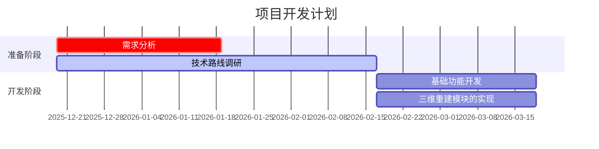
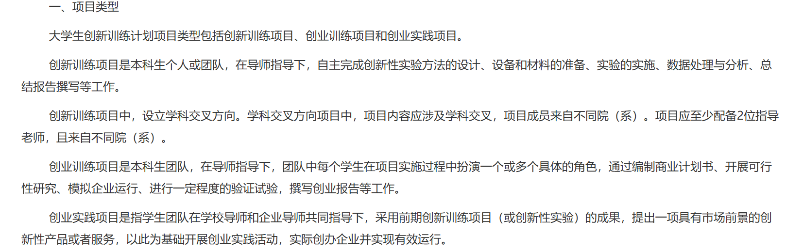

# 前期安排
## 项目介绍

这是一款基于**三维重建**的社交应用，用户可以通过应用上传照片，应用会根据照片重建出三维模型。我们的应用除了有像常见的小红书等社交应用一样展示图片，live，视频的功能，还可以将用户的**三维模型**展示出来，用户可以通过三维模型与其他用户进行互动,像聊天、点赞、评论等。

## 项目功能
- 基本的发布，浏览，评论等功能（和小红书类似）
- 三维重建功能
    - 提示功能：在用户拍照时，需要提示用户旋转镜头来获取更多的照片，以提高三维重建的准确性（做成主动式，能不能发文章）
    - 重建功能：用户上传照片后，应用会根据照片重建出三维模型
    - 查看功能：用户可以查看自己的三维模型，也可以查看其他用户的三维模型
    - 编辑功能：用户可以对自己的三维模型进行编辑，比如改变颜色，添加装饰元素，放在场景中展示等

## 任务分解
- 前端：负责应用的**用户界面设计和实现**，包括发布，浏览，评论，三维模型展示等功能

- 后端：负责应用的**功能**实现，包括用户注册，登录，发布，浏览，评论，三维模型存储等功能

- 三维重建模块：负责根据用户上传的照片，调用**三维重建算法**，生成三维模型

## 时间安排

| 时间节点       | 任务内容               | 负责人   |
| -------------- | --------------------- | -------- |
|12月底之前       |完成项目报名                 |赵卓凡
|12月底之前       | 了解git,会push,pull,merge,fork就行                | 所有成员
|回家之前         |需求报告撰写                |所有成员 
|寒假年前         |确定技术路线                 |所有成员
|寒假年后         |完成基础功能部分（界面，发布查看图片视频，评论的功能），给三维重建部分留好接口               | 有待分工
|3月之前          |完成三维重建模块的实现，包括三维重建算法的选择，模型的存储和展示等功能，可以不先往应用中加     |赵卓凡

### 待办
- [x] 学习git,了解如何团队协作，[教程](https://www.runoob.com/git/git-tutorial.html)看到分支管理就好
- [x] 大创报名，想一个项目和团队名字，决定是投创新训练还是创业训练（应该需要一名同学专门去做宣传，编写商业计划书，可能会有路演宣传之类）
- [ ] 需求报告撰写
## 问题
- [x] 三维重建得到的模型是否具有可编辑性
    - 可以对场景中的模型进行编辑，比如改变颜色，增减装饰元素等，也可以从场景中提取物品模型

- [ ] 是否需要将场景重建和物品重建区分开
    - 目前意见：可以根据三维重建算法的需求来定。比如我只想重建一个放在场景中的物品，而不是整个场景，如果需要的图片量差不多的话，可以直接对场景进行重建，然后之后再由用户从场景中提取物品模型

- [ ] 三维重建的效果可能不太能保证，应该做不到像图片那样高清和完整